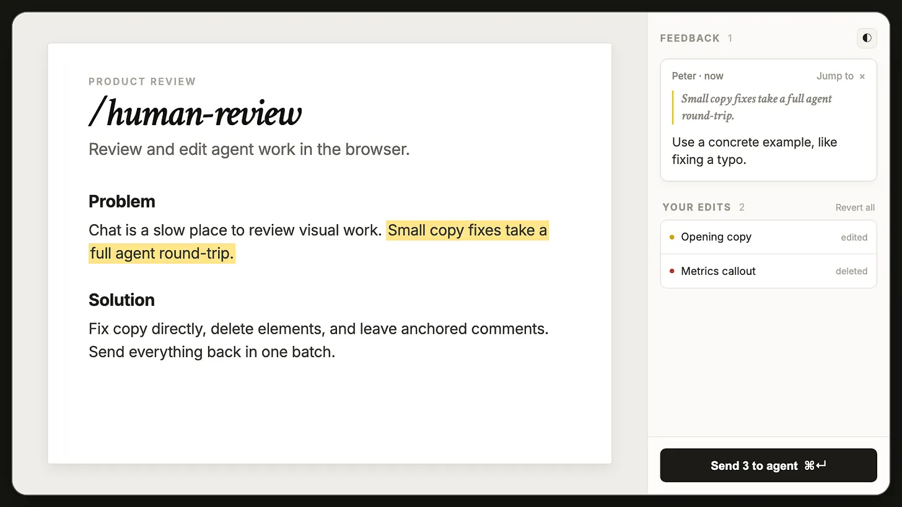

# Human Review

Edit HTML and Markdown files directly, leave comments like a Google Doc, and send all your feedback to your AI agent at once.

[Read the full launch post](https://creatoreconomy.so/p/use-my-human-review-skill-to-edit-html-markdown-visually)

https://github.com/user-attachments/assets/7cab09c9-eaa0-4e8b-984d-2925e810b5c2

## Problem

Giving AI feedback on files in chat is painful.

Sometimes you want to change one sentence yourself. Instead, you end up typing:

> In the third paragraph, change X to Y. Cut the third card because it repeats the first one. Also rewrite the CTA.

Then the agent changes the file and you have to check whether it understood every instruction. This gets even harder when you’re reviewing a long plan, Markdown document, landing page, or multi-page website.

## How to install /human-review

The easiest way to install the skill is to paste this into ChatGPT, Claude Code, Codex, or your favorite coding agent:

```text
Install the /human-review skill globally from https://github.com/petergyang/human-review
```

You can also install it with `npx`:

```sh
npx -y human-review setup --global
```

## How to use /human-review



Open an HTML or Markdown file:

```text
/human-review (your file)
```

Review a page running on localhost:

```text
/human-review (localhost URL)
```

Human Review opens the file in your browser. Make direct edits, leave comments, and click Send. Your agent receives all your feedback in one batch, updates the source, and refreshes the page for another review.

Note: For HTML files, direct edits and resizes save automatically. For Markdown and localhost pages, click Send so your agent can apply them to the source.

## Review a large plan

The skill can create a temporary single-file HTML review artifact even when the plan starts as Markdown, plain text, working notes, or chat content.

Ask your agent to create a planning review artifact, then review it with the same `/human-review` loop. Each major section includes compact action checkboxes for:

- **Revise** — substantively rewrite the section.
- **Expand** — add missing depth or detail.
- **Touch up** — make small clarity or organization improvements.
- **Remove** — delete the section.
- **Verify** — validate assumptions or technical claims and correct them.

You can combine those markers with direct text edits and exact-text comments. When you click Send, the agent treats the three feedback types differently: your direct edits are preserved as exact wording, comments provide specific instructions, and section actions tell the agent what kind of follow-up work to perform.

The generated `.review.html` remains a review surface. If the plan has a canonical Markdown, MDX, or other source file, the agent applies the approved changes back to that source and clears the action markers before the next review pass.

## What this skill lets you do

- **Edit text directly and tweak basic formatting** (e.g., bold, italic).
- **Make bulleted and numbered lists** — type `- ` or `1. ` at the start of a line, or press ⌘⇧8 / ⌘⇧7. Tab and Shift+Tab indent and outdent.
- **Add links** — select text and press ⌘K. ⌘K inside an existing link edits or removes it.
- **Resize images** by dragging their corner, and **move images** by dragging them to a new spot.
- **Rearrange the page** — hover any block and drag the handle on its left edge to move the whole block somewhere else.
- **Paste images** from your clipboard — file reviews save them beside the document; localhost reviews stage them for the agent to place in the app source.
- **Select a phrase and leave a comment** anchored to the exact text.
- **Comment on an image, chart, or section** by clicking the element.
- **Mark planning sections** for revise, expand, touch-up, remove, or verify work in generated planning review artifacts.
- **Remove elements** without explaining the deletion in chat.
- **Command-click links** to review multiple pages without losing your feedback.
- **Send every edit and comment at once** instead of writing a long chat message.

I use Human Review to edit AI-generated plans, update landing pages, review localhost apps, and remove the extra copy AI likes to add to UX.

## What’s inside

- [`cli.js`](src/cli.js) contains the `human-review`, `poll`, `status`, and `setup` commands.
- [`server.js`](src/server.js) runs the local review session.
- [`sdk.js`](src/sdk.js) handles editing, comments, highlights, and feedback.
- [`chrome-client.js`](src/chrome-client.js) contains the visual review interface.
- [`markdown.js`](src/markdown.js) renders Markdown files for review.
- [`SKILL.md`](src/SKILL.md) teaches Claude Code, Codex, and other agents how to use Human Review.

Everything runs on your computer. Human Review doesn’t require an account, cloud service, database, or API key.

## Want more great AI skills?

Check out [Behind the Craft](https://behindthecraft.com), my personal AI system with over a dozen other quality skills and courses.

Subscribe to my [YouTube channel](https://youtube.com/@PeterYangYT?sub_confirmation=1) and [newsletter](https://creatoreconomy.so) for practical AI tutorials and interviews.

## License

MIT
